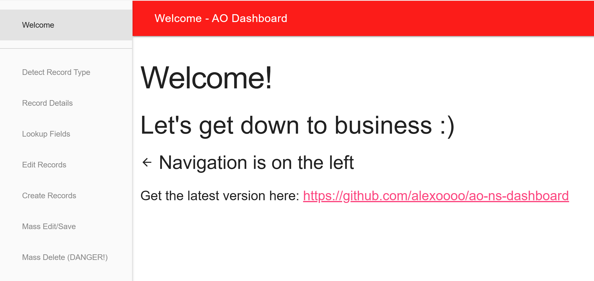

# ao-ns-dashboard

NetSuite SuiteScript 2.1 admin & automation dashboard — a single Suitelet that adds a small UI to a NetSuite account for inspecting, editing, and bulk-mutating records.

## Features

- **Detect Record Type** — given an Internal or External ID, find which record type(s) it belongs to.
- **Record Details** — view every field and sublist line on a record in one page (great for discovering field IDs).
- **Lookup Fields** — script-driven field reads across many records, including arbitrary sublist queries.
- **Edit Records** — batch field assignments and sublist insert/remove operations against existing records.
- **Create Records** — bulk-create with default values + post-create field values.
- **Mass Edit/Save** — load and re-save records to fire downstream automation without changing data.
- **Mass Delete** — irreversible bulk delete with per-record confirmation.
- **SuiteQL Query** — run paginated SuiteQL with CSV export.

The header turns red on non-sandbox environments as a safety reminder.



## Installation

`ao-ns-dashboard.js` at the repo root is the bundle to upload — Customization / Scripting / Scripts / New, then:

1. **Script File** → [+] → Choose file → select `ao-ns-dashboard.js`, set "file name" to `ao-ns-dashboard.js`, Save.
2. **Create Script Record**.
3. **Deployments** → Add new.

## Development

Requirements: Node.js 20+.

```bash
npm install              # one-time
npm run build            # produces ao-ns-dashboard.js
npm run dev              # watch mode (rebuild on save)
npm run check            # tsc + eslint + prettier + vitest — run before committing
```

After every `src/**` change, regenerate and commit `ao-ns-dashboard.js`. End-to-end verification is manual against a NetSuite sandbox; see [CONTRIBUTING.md](CONTRIBUTING.md) for the test checklist.

For architecture, conventions, and gotchas, see [AGENTS.md](AGENTS.md).
